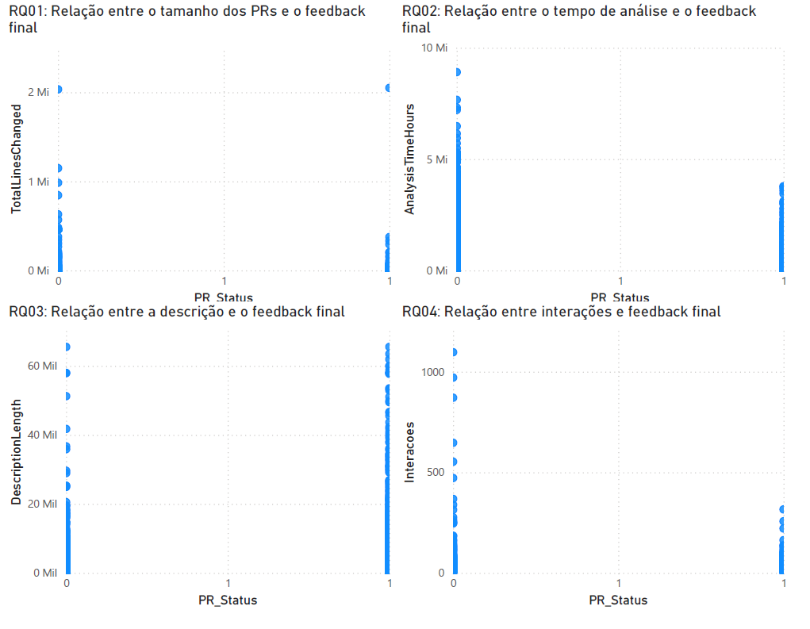
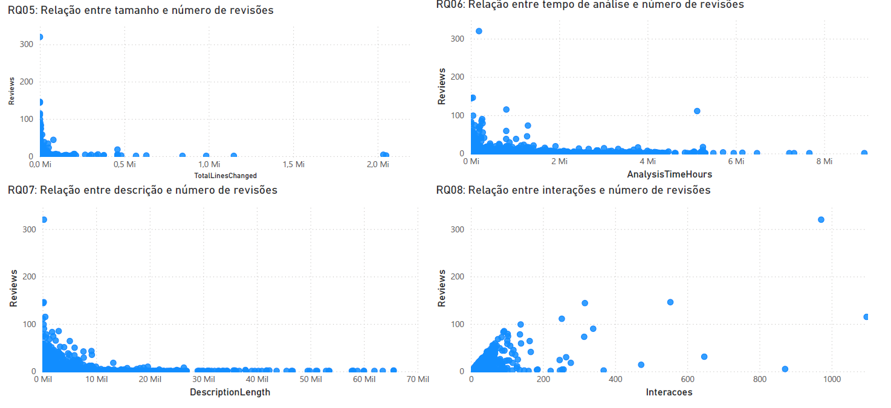

# 🧪 **Laboratório 04 – Visualização de Dados de Code Review com Power BI**

## 1. Informações do grupo

* **🎓 Curso:** Engenharia de Software
* **📘 Disciplina:** Laboratório de Experimentação de Software
* **🗓 Período:** 6° Período
* **👨‍🏫 Professor:** João Paulo Carneiro Aramuni
* **👥 Membros do Grupo:** Gabriel Henrique Silva Pereira e Gustavo Menezes Barbosa

---

# 2. Introdução

O objetivo deste Laboratório 04 é aplicar uma ferramenta de Business Intelligence (Power BI) para explorar visualmente o dataset produzido no Laboratório 03, caracterizando Pull Requests (PRs) de repositórios populares do GitHub e analisando relações entre características dos PRs e o processo de revisão.

A escolha de utilizar exatamente o mesmo dataset do Laboratório 03 foi intencional:
- Permitiu comparar os resultados gerados via scripts em Python com os resultados agora visualizados no Power BI.
- Possibilitou avaliar se as visualizações oferecem novas percepções sobre as mesmas questões de pesquisa, e assim confirmar ou refutar o que foi discutido no laboratório anterior.
- Tornou possível aprender a construir dashboards interativos com dados reais já conhecidos pela equipe.

---

## 2.1 Questões de Pesquisa (Research Questions – RQs)

As Questões de Pesquisa (RQs) permanecem as mesmas do Lab 03, pois o objetivo deste laboratório é justamente responder a elas usando ferramentas de BI, comparando os resultados com as análises numéricas anteriores.

| RQ       | Pergunta                                                                           |
| -------- | ---------------------------------------------------------------------------------- |
| **RQ01** | Qual a relação entre o tamanho dos PRs e o feedback final das revisões?            |
| **RQ02** | Qual a relação entre o tempo de análise dos PRs e o feedback final das revisões?   |
| **RQ03** | Qual a relação entre a descrição dos PRs e o feedback final das revisões?          |
| **RQ04** | Qual a relação entre as interações nos PRs e o feedback final das revisões?        |
| **RQ05** | Qual a relação entre o tamanho dos PRs e o número de revisões realizadas?          |
| **RQ06** | Qual a relação entre o tempo de análise dos PRs e o número de revisões realizadas? |
| **RQ07** | Qual a relação entre a descrição dos PRs e o número de revisões realizadas?        |
| **RQ08** | Qual a relação entre as interações nos PRs e o número de revisões realizadas?      |

---

## 2.2 Hipóteses Informais (Informal Hypotheses – IH)

Foram mantidas as mesmas hipóteses do laboratório anterior, pois o objetivo é verificar se as evidências visualizadas em Power BI confirmam ou reforçam as conclusões prévias.

| IH       | Descrição                                                                                                |
| -------- | -------------------------------------------------------------------------------------------------------- |
| **IH01** | PRs maiores (com mais arquivos e linhas alteradas) tendem a levar mais tempo para serem revisados.       |
| **IH02** | PRs com descrições mais detalhadas têm maior probabilidade de serem aceitos (MERGED).                    |
| **IH03** | PRs com maior número de participantes e comentários representam revisões mais colaborativas e complexas. |
| **IH04** | PRs analisados rapidamente (menos de 24h) tendem a ser menores e mais simples.                           |
| **IH05** | Projetos populares, com muitos PRs, apresentam padrões mais consistentes de revisão e aceitação.         |

As conclusões apresentadas no Lab 03 permanecem válidas — e agora foram confirmadas visualmente via dashboard.

---

# 3. Metodologia / Descrição da Base de Dados

A metodologia segue a mesma do Laboratório 03, pois este laboratório não envolveu nova coleta de dados, mas sim a visualização do dataset previamente construído.

---

## 3.1 Coleta de dados (Lab 03)

A coleta foi realizada utilizando a GitHub GraphQL API, por meio de scripts Python.
Foram coletados dados de PRs de 200 repositórios populares do GitHub, filtrando:

* PRs MERGED ou CLOSED
* PRs com pelo menos uma revisão humana
* Exclusão de PRs com menos de 1 hora de análise
* Uso de paginação (50 PRs por página)
* Controle de limite de requisições (rate limit)

O resultado foi um arquivo:

📄 **pull_requests.csv**

Com colunas como:

* `State`, `PR_Status`
* `AnalysisTimeHours`
* `FilesChanged`, `Additions`, `Deletions`, `TotalLinesChanged`
* `DescriptionLength`
* `Participants`, `Comments`, `Reviews`

---

## 3.2 Pré-processamento e normalização

Os dados foram limpos e unificados em um formato tabular.
Foi criado também um resumo estatístico (`resumo_medianas.csv`) com as medianas das principais métricas.

---

## 3.3 Uso no Laboratório 04

No Lab 04 foi feito o seguinte:

* Importação do `pull_requests.csv` no Power BI.
* Identificação das mesmas métricas usadas no Lab 03.
* Criação de um dashboard com duas páginas:

  * Feedback Final (RQ01–RQ04)
  * Número de Revisões (RQ05–RQ08)
* Cada página contém quatro gráficos, um para cada RQ.
* Foram adicionados *slicers* interativos para permitir análise exploratória.
* Todas as interações foram configuradas para *Filter*, permitindo filtragem dinâmica.

---

# 4. Resultados

As visualizações produzidas no Power BI possibilitaram uma confirmação clara e intuitiva das relações previamente identificadas no Laboratório 03. Como o dataset, as métricas e as questões de pesquisa permanecem inalterados, o objetivo desta etapa foi verificar se os padrões anteriormente observados ainda se sustentam quando representados por meio de dashboards interativos.

O uso do Power BI permitiu explorar graficamente as hipóteses informais (IHs) formuladas no Lab 03 com maior nitidez e capacidade de filtragem dinâmica. Os resultados obtidos visualmente confirmaram integralmente as conclusões anteriores, conforme detalhado a seguir.

---

## 4.1 Confirmação das Hipóteses Informais (IH) por meio das visualizações

- IH01 – PRs maiores tendem a levar mais tempo para serem revisados.

- IH02 – PRs com descrições mais detalhadas tendem a ser aceitos com maior frequência.

- IH03 – PRs com maior número de participantes e comentários representam revisões mais colaborativas e complexas.

- IH04 – Revisões rápidas são de PRs menores e mais simples.

- IH05 – Repositórios populares apresentam padrões consistentes de revisão e aceitação.

## 4.2 Relações entre Métricas e RQs (validadas novamente)

Além da confirmação das hipóteses, o uso do Power BI reafirmou todas as relações descritas nas RQs:

* **Tamanho do PR (RQ01 e RQ05):** Tendência clara de maior esforço de revisão e tempo para PRs maiores.
* **Tempo de Análise (RQ02 e RQ06):** Correlação positiva com complexidade do PR e número de revisões.
* **Descrição (RQ03 e RQ07):** Descrições longas favorecem aprovação e reduzem iterações.
* **Interações (RQ04 e RQ08):** Revisões rejeitadas e complexas exibem maior participação e mais comentários.

---

# 5. Discussão

O uso do Power BI permitiu:

### ✔ Confirmar todos os achados do Lab 03

As relações observadas anteriormente tornaram-se mais evidentes nos gráficos interativos.

### ✔ Explorar padrões de forma visual

A filtragem por tamanho, tempo, status e número de interações ajudou a perceber nuances como:

* PRs muito grandes raramente são aprovados sem várias revisões
* Equipes com mais participantes tendem a discutir mais em PRs rejeitados
* O tempo de análise cresce de forma clara com o tamanho do PR

### ✔ Facilitar a comunicação dos resultados

O dashboard permite que outros grupos, professores ou avaliadores compreendam rapidamente os padrões do dataset.

### ✔ Consolidar as conclusões das Hipóteses Informais (IHs)

Todas as hipóteses do Lab 03 permanecem confirmadas ou parcialmente confirmadas, conforme já discutido naquele relatório.

---

# 6. Conclusão Final

Neste Laboratório 04, o Power BI foi utilizado para visualizar o dataset previamente coletado no Laboratório 03.
O objetivo era aprender a:

* Montar dashboards
* Criar visualizações adequadas às RQs
* Utilizar filtros e interatividade
* Reforçar conclusões com base visual

Os resultados visuais obtidos foram os mesmos do Lab 03, confirmando todas as relações estatísticas observadas anteriormente.

Assim, o Lab 04 cumpriu sua função principal:
transformar análises programáticas em análises visuais, mantendo a integridade científica da investigação.
